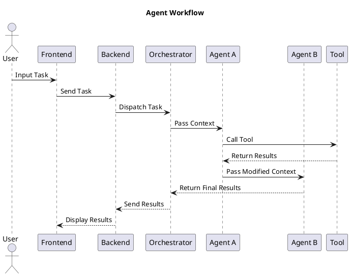

# Agent Workflow

Agents process tasks passed by the orchestrator, using tools and plugins as needed.

## Workflow Steps

1. **Orchestrator**:
   - Receives tasks and passes context to agents.
2. **Agents**:
   - Modify context, call tools, and collaborate with other agents.
3. **Completion**:
   - Results flow back to the orchestrator.

## Handling Failures and Retries

To ensure robustness in the workflow, agents and the orchestrator implement the following mechanisms:

1. **Error Detection**:

   - Agents monitor for exceptions during task execution.
   - Context includes error flags and metadata to signal issues upstream.

2. **Retry Mechanism**:

   - Tasks are retried up to a configurable number of times upon failure.
   - Retry intervals can include exponential backoff to reduce resource strain.

3. **Fallback Agents**:

   - Designated fallback agents handle unresolvable errors or escalate issues for manual intervention.

4. **Logging and Monitoring**:
   - Comprehensive logging ensures traceability of errors.
   - Real-time monitoring and alerts enable proactive resolution.
