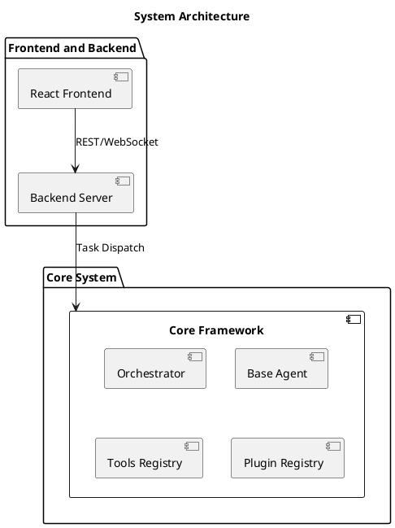

# System Architecture

The system architecture defines the interaction between core components such as the frontend, backend, orchestrator, agents, and plugins.

## Components

1. **Frontend**: A React-based application.
2. **Backend**: A server that handles task dispatching.
3. **Core Framework**: Includes orchestrator and tools/plugins registries.

## Architectural Decisions

The following design choices were made to ensure scalability, modularity, and ease of use:

1. **React for Frontend**:
   - React was chosen for its component-based architecture, making it easy to build reusable UI elements.
2. **Backend Server**:
   - Node.js was selected for its asynchronous, event-driven model, which aligns with the real-time task handling needed by the orchestrator.
3. **Plugin and Tool Registries**:
   - Centralized registries were implemented to standardize the integration of tools and plugins, ensuring compatibility and reducing duplication.
4. **Agent-Orchestrator Model**:
   - This modular approach allows agents to operate independently while still collaborating through the orchestrator.

The overall architecture prioritizes developer experience and extensibility, ensuring new features and agents can be added with minimal disruption.
