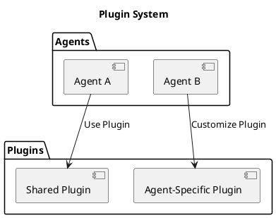

Plugins extend the functionality of agents, providing reusable logic and tools.

```plantuml
@startuml
title Plugin System

package "Plugins" {
  component "Shared Plugin" as SharedPlugin
  component "Agent-Specific Plugin" as AgentPlugin
}

package "Agents" {
  component "Agent A" as AgentA
  component "Agent B" as AgentB
}

AgentA --> SharedPlugin : Use Plugin
AgentB --> AgentPlugin : Customize Plugin
@enduml
```

## Features

1. **Shared Plugins**: Available system-wide.
2. **Agent-Specific Plugins**: Customized per agent.
